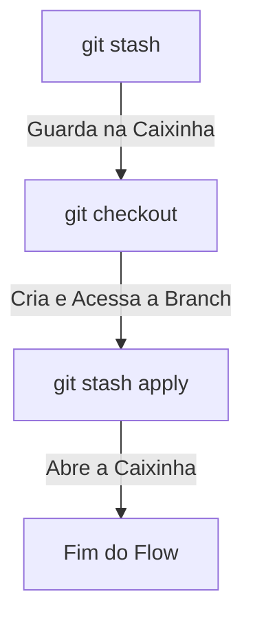
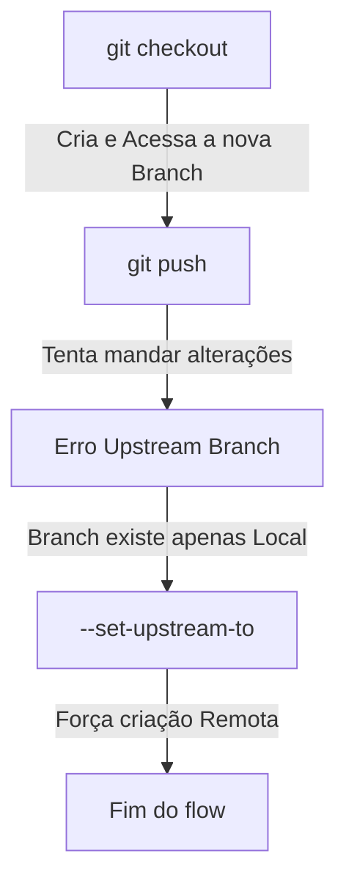
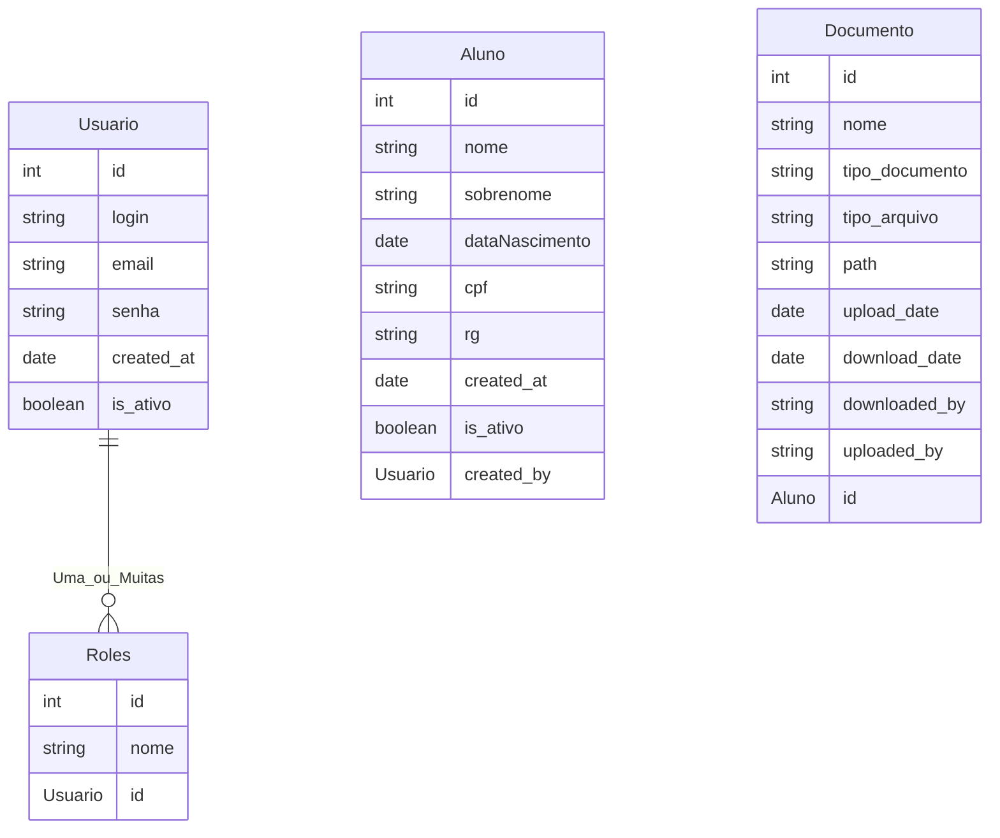

# GED App - Gerenciador de Documentos

### Projeto Integrador - APAE Criciúma

Este projeto tem como objetivo desenvolver um aplicativo de gestão de documentos para a APAE de Criciúma, fornecendo uma solução eficiente e acessível para o gerenciamento de arquivos.

---

## Guia Inicial do Projeto

### Pré-requisitos

- **Java 21**  
- **Docker** e **WSL** instalados na máquina (preferível)
- **IDE** de sua escolha (ex.: IntelliJ, VS Code)
- **PostgreSQL**

---

## Clonar o repositório

Clone o repositório na pasta que preferir do seu computador com o seguinte comando no seu terminal:
```bash
  git clone https://github.com/JuannCarloss/ged-app.git
```
---

## Após clonar

- Abra o projeto na sua IDE
- Va no arquivo application.properties dentro da pasta resources
- Coloque um ```#``` ao lado do comando ```spring.sql.init.mode=always```
- Abra o terminal interno da IDE e execute o seguinte comando nele:
```bash
  mvn clean install  
```
---

- Após isso, retirar o ```#``` da linha
- Subir a aplicação

## Swagger
O Swagger é um pacote de dependências do Java que cria sozinho um front-end básico que documenta os endpoints e controllers que existem na aplicação

As configurações necessárias para que ele funcione já estão feitas, sendo necessário apenas algumas anotações nos controllers que você pode encontrar os  exemplos explicados abaixo em ``/controllers/HealthChecker.java``

Para ver esse front-end **Inicie a Aplicação** e <a href="http://localhost:8080/swagger-ui/index.html">Clique aqui</a>

---

### Anotações do Swagger

# ``@Tag``

A anotação ``@Tag`` é responsável por agrupar nossos endpoints em algum contexto, por exemplo: 

### Sem ``@Tag``


### Com ``@Tag`` com o nome "Saúde"


Dessa forma, caso eu crie mais um endcpoint no ``/controllers/HealthChecker.java`` colocando ele nessa ``@Tag`` com nome **"Saúde"**, no Swagger eles vão ficar agrupadinhos e fáceis de se encontrar, por exemplo:


---

# ``@Operation``

A anotação ``@Operation`` é responsável por esclarecer o que cada endpoint faz, por exemplo:

### Com ``@Operation`` (endpoint ``/health/cheacker1``)


Vou deixar por enquanto apenas essas duas anotações para o pessoal pegar o jeito por enquanto, ao alocar tarefas, vou explicando outras anotações que vamos usar.

---

# Commit Standards (Padrões de Commit)

Como nosso foco nesse projeto vai ser a documentação para deixar esse lindo legado para as próximas turmas de ADS modificarem o mesmo, o mais correto a se fazer é seguirmos alguns padrões pelo menos de documentação para que eles possam se encontrar com mais facilidade no futuro, por isso pensei em seguirmos alguns padrões de commits para esse projeto

### O que é ?

Padrões de commit é uma prática onde vamos identificar o tipo do commit anotando o início dele com alguns nomes **PADRÕES**, os nomes que mais vamos usar acredito que possa vir ser:

---

**FEAT** - usado quando você cria alguma nova funcionalidade, por exemplo:

Criei um novo método de encriptar a senha na classe service, o commit seria:

**Feat: método que criptografa a senha do usuário**

---

**REFACT** - usado quando você apenas refatora algum bloco de código, sem alterar a funcionalidade do código em sí, por exemplo:

Mudei o código de salvar usuário e apenas mudei a mensagem da exception, deixando ela mais clara, o commit seria:

**Refact: mensagem da exception melhorada para maior clareza**

---

**BUILD** - usado quando você muda alguma configuração que afete o start/runtime da aplicação, por exemplo:

Adicionei a dependência do Spring Security na Aplicação, o commit seria:

**Build: dependência do Spring Security adicionado**

---

**FIX** - usado quando você ajusta algum bug no código, por exemplo:

Fiz uma mudança em um código que deveria retornar paginado de 5 em 5 e retornava de 10 em 10, o commit seria:

**Fix: ajustado para paginação 5 em 5**

---

Caso tenha se interessado no assunto e queira ver mais anotações e padrões que o mercado de trabalho segue, fica o link para leitura: <a href="https://medium.com/linkapi-solutions/conventional-commits-pattern-3778d1a1e657">Conventional Commits</a>

Caso tenham alguma dúvida, fiquem a vontade para entrar em contato comigo que eu ajudo com todo prazer, quaisquer mudanças que verem e quiserem adicionar a esse documento estão livres para faze-lá, agradeço a compreensão de todos.

---

# Flow de Versionamento (GIT e companhia)

Com os GPs tendo conhecimento dos requisitos desse MVP, os mesmo vão começar a alocar tarefas para sua equipe, com isso podemos prever que vamos ter várias pessoas trabalhando no mesmo projeto ao mesmo tempo, o que pode fazer com que ocorra **conflito nos commits.**

## O Problema
### Conflitos:

Vamos supor que fulaninho esteja fazendo uma alteração na classe <b>``UsuarioService.java``</b> na branch **main** do projeto **(o que é bem errado e você ja vai entender o por que)**,  na hora que ele termina a tarefa dele, depois de testar e ver que esta de fato funcionando e agindo do jeito que tem que agir, ele vai querer commitar, porém na hora que ele vai fazer isso, recebe um aviso dizendo mais ou menos que: **A branch remota tem novas modificações**. Essa mensagem avisa que alguém **commitou** ou **mergeou** modificações la antes de você, seja pra roubar sua tarefa ou seja lá o que ela podia estar fazendo de alteração no projeto. E agora ?

## A solução
Temos duas soluções possíveis para esse caso, vou explicar as duas abaixo:

### 1° Solução - Git Stash (para quando a bomba ja explodiu):

Agora, fulaninho vendo a mensagem de erro pensa "**puts, e se alguém mexeu na mesma classe que a minha ? Se eu atualizar vai sobreescrever tudo o que eu fiz!**, e o fulaninho esta mais que certo. É nesse momento que o comando <b>``git stash``</b> pode vir a calhar.
  
### O que o git stash faz ?
O <b>``git stash``</b> guarda todas as suas alterações locais dentro de uma "caixinha", te dando assim a liberdade de receber qualquer modificação **remota** da branch que você está atualmente. Como assim ?

Fulaninho se viu diante do problema e lembrou do comando <b>``git stash``</b>, quando ele executa esse comando, todas as suas **modificações** são "guardadas" dentro dessa caixinha e somem do arquivo atual, dando espaço para as **atualizações remotas**.

Okay, com suas mudanças dentro dessa **"caixinha"**, agora fulaninho está livre para fazer o **git pull** e receber essas mudanças sem perder o que ele já tinha feito **(o que ele fez esta dentro da caixinha do stash)**, após executar o <b>``git pull``</b> e receber as modificações, o próximo comando seria **"liberar"** essas modificações guardadas na caixinha, certo ? 

**Errado!!!** Se ele fazer isso, persistiria no erro de estar modificando direto na branch **main** do projeto e continuaria se colocando em risco da mesma bomba explodir de novo.

Fulaninho agora com toda sua carga de experiência provida pelos erros que ele cometeu em sua vida, cria uma **nova branch** específica para sua tarefa **(spoiler da 2° solução)**, ele acessa essa branch e finalmente pode **"liberar"** essas mudanças nessa nova branch, dessa forma, dentro da **branch** que ele criou, ele executa o seguinte comando <b>``git stash apply``</b>, que **"abre"** aquela caixinha e coloca todas as modificações dele nessa nova branch.

O flow ficaria dessa forma: 


Cansativo ? Muito!!! Olha o tanto de volta que o fulaninho teve que dar pra resolver um conflito, o certo seria evitar eles né ? E a gente pode, com a 2° solução a gente evita muitas dessas dores de cabeça.

> **Atenção:** Ensinei o flow do **git stash** por que acontece de as vezes acabarmos fazendo mudanças direto na branch **main** e ta tudo bem caso aconteça, mas o certo seria evitar isso, okay ?.

---

### 2° Solução - Branch por Tarefa (a mais segura de todas)

Fulaninho recebeu uma nova tarefa do seu GP e agora ele quer seguir as boas práticas pra evitar a mesma dor de cabeça de antes, com isso em mente, o fulaninho cria uma branch **específica da tarefa**. Como assim ?

Hoje o fulaninho recebeu uma nova tarefa e o card dela la no trello tem o seguinte título **"Criar CRUD de usuários"**, vendo isso, o fulaninho acessa **branch main** do projeto pela IDE que ele escolheu, abre o terminal dela e executa o seguinte comando <b>``git checkout -b crud-usuarios``</b>

### O que o git checkout faz ?

O comando <b>``git checkout -b crud-usuarios``</b> vai criar e acessar essa branch nova chamada **"crud usuarios"** no projeto, onde nela o fulaninho vai estar livre pra fazer qualquer modificação ligada a essa tarefa que deu nome a branch.

Terminando de fazer as alterações, o fulaninho vai querer commitar essas mudanças **(git push)**, e **pode** acontecer o seguinte erro:

``The upstream branch of your current branch 'crud-usuarios' does not  match the name of your current branch.``

Ao ver esse erro, fulaninho, um cara muito informado, executa o seguinte comando <b>``git push --set-upstream-to origin crud-usuarios``</b>. Mas por que fazer isso ?

Ao executar o comando <b>``git checkout -b crud-usuarios``</b>, fulaninho criou uma branch **local**, isso quer dizer que essa branch **crud-usuarios** existe apenas na máquina dele, por isso ao executar o **git push** o erro citado acima ocorre, por isso executamos o <b>``git push --set-upstream-to origin crud-usuarios``</b> que força a criação dessa branch no repositório **remoto**

O flow ficaria dessa forma: 


>**Atenção**: o <b>``git push --set-upstream-to origin "nome-da-branch"``</b> precisa ser executado apenas uma vez por branch.

## Comandos novos citados
|Função                              |Comando                        |
|------------------------------------|-------------------------------|
|Guarda as alterações na **caixinha**|<b>``git stash``</b>           |
|Libera as alterações da **caixinha**|<b>``git stash apply``</b>     |
|Cria e acessa uma nova branch       |<b>``git checkout -b "nome-da-branch"``</b> (sem aspas)|
|Forçar criação remota da branch     |<b>``git push --set-upstream-to origin "nome-da-branch"``</b> (sem aspas)|
## Conclusão

Seguindo as experiências que o fulaninho compartilhou com a gente, vamos evitar **MUITA** dor de cabeça com o versionamento desse projeto, por mais que não vamos fazer nada de muito grandioso *(até por que não vai dar tempo)*, ainda assim vão ser várias pessoas acessando o mesmo repositório ao mesmo tempo.
> **Atenção:** Se ainda estiver com dúvidas sobre este fluxo, pode entrar em contato comigo ou com alguém que ja tenha feito e entendido para te ajudar, melhor previnir que remediar!!

# Diagrama ER
Abaixo vou apresentar quais as tabelas vamos usar, tanto as já criadas quanto as que podem aparecer com o progresso do projeto estão sujeitas a mudanças, sempre atente-se a sua tarefa para verificar se a mesma não altera alguma estrutura da tabela, caso altere, favor atualizar a documentação ou entrar em contato com seu GP para que ele altere a doc.



### Usuario e Roles

Meta Dados básicos, podem vir a aparecer mais ou deixar de ter alguns dependendo das demandas que vão aparecendo

Um usuário pode ter uma ou muitas **roles(papéis)**, por exemplo: **user, admin, superAdmin, etc**

<b>``is_ativo:``</b> Campo booleano para sinalizar se um usuario está ativo para usar o sistema.

### Alunos

Meta Dados básicos, podem vir a aparecer mais ou deixar de ter alguns dependendo das demandas que vão aparecendo

<b>``is_ativo:``</b> Campo booleano para sinalizar se um aluno está ativo para ser listado no sistema.

### Documento

<b>``tipo_documento:``</b> Um enumerador para sinalizar que tipo de documento é, por exemplo: **Prontuário, Certidões, Comprovantes, etc**.

<b>``tipo_arquivo:``</b> Um enumerador para sinalizar o tipo do arquivo, por exemplo: **PDF, JPG, XLSX, etc**.

<b>``path:``</b> Caminho ou URL do arquivo, para que ele possa ser baixado ou renderizado no front-end.

<b>``download_date:``</b> Para podermos filtrar pelos últimos documentos acessados.

<b>``downloaded_by e uploaded_by:``</b> Para sinalizar quem subiu e quem baixou o arquivo.

---

# Pull Requests - Como contribuir
Segue explicativo de como usar o template para contribuir usando os PRs:

[_Use como referência a documentação do Conventional Commits_](https://github.com/iuricode/padroes-de-commits)

1. Preencher informações relevantes como: 

    _Seções não usadas devem ser apagadas_
    - Descrição | **Evidenciar o que foi feito**

    - Problema Relacionado(Se houver)

    - Checklist - **Use enquanto estiver criando o PR**

    - Capturas de tela(Se houver)

    - Notas adicionais | **Use para destacar informações úteis para quem for revisar**
        
        Exemplo: Tarefa relacionada: [#1](link)

2. Informar revisor(es)

3. Atribuir usuários

4. Adicionar tag/label - **Indica o contexto do PR, como "bug"**

6. Revisar

7. Criar

8. Informar e solicitar aprovação